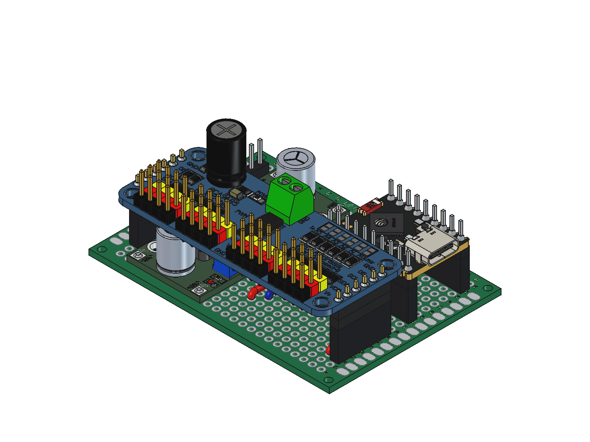

# Sesame S3 assembled electronics

## Open this file

**[`Sesame-S3-Assembly.FCStd`](Sesame-S3-Assembly.FCStd)** is the single
authoritative CAD document for the completed electronics assembly.

Use **FreeCAD 1.1.3 or newer**. It contains the green carrier PCB, LM2596 converter,
PCA9685 servo hub, ESP32-S3 SuperMini, headers, detachable sockets, jumpers and
underside wiring, with their native materials and editable construction features.
It is the electronics assembly; the robot enclosure and external harnesses are
outside its present scope.

```sh
git lfs pull --include="assets/cad/Sesame-S3-Assembly.FCStd" --exclude=""
```

Open the file directly, or run `tools/open_cad.FCMacro` in FreeCAD. Both CAD opening
macros now select this complete assembly and retain saved visibility, so hidden
Boolean tools and source components do not appear on top of the finished model.
Opening never creates a replacement carrier-only document.



## What lives where

| Path | Purpose |
|---|---|
| `Sesame-S3-Assembly.FCStd` | **Open/edit this.** One self-contained native assembly, stored through Git LFS. |
| `instructions/` | Ordered construction steps, part IDs, pinouts, source evidence, uncertainty and a renderer-independent CAD snapshot. Retained for future animated instructions. |
| `reports/` | Geometry, alignment and wiring validation; historical source research is labeled by its original scope. |
| `fonts/`, `licenses/`, `sources.json` | Reproducible lettering, source identities and retained third-party notices. |
| `HISTORY.md` | Earlier carrier/reference construction notes; not the opening instructions. |
| `upstream/` | Ignored source-download cache; not required to open the assembly. |

There is no separate carrier-only working file, layout-start file or native
Adafruit reference file to choose between. Imported references can be recreated
from `sources.json` with `tools/fetch_cad.py` and `tools/inspect_cad.py`; derived
reference documents go only into the ignored source cache.

## Inside the document

- **ASSEMBLED ELECTRONICS** is the visible finished result. Converter, removable
  hub/S3 units, fixed sockets, pins, solder, insulation and wires remain separate
  native objects. Existing `Name` and `InstructionId` values are preserved.
- **Carrier construction history** is hidden, but retains the original editable
  board, 432 addressed holes, pad links, lettering, dimensions and expressions.
  The installed carrier display objects are the original verified geometry
  snapshots; refresh these after dimensional edits to their embedded source.
- **Provenance and animated-instruction metadata** records source-document hashes,
  coordinate conventions, stable-ID rules and paths to the instruction records.

The assembly has no external FreeCAD document links. Copying the `.FCStd` alone
is sufficient for viewing. Copy `instructions/`, `fonts/` and the source notices
as well when transferring the instruction-authoring workspace. The bundled font
is only needed when recomputing editable carrier lettering.

## Animated instruction authoring

See [instructions/README.md](instructions/README.md). The native CAD is the source
of geometry; JSON records preserve physical operations that a finished model
alone cannot explain. Keep both in sync after edits:

```python
import runpy
runpy.run_path('/path/to/sim2real/tools/export_instruction_snapshot.py')
```

Save the assembly first. The exporter is read-only and writes
`instructions/assembly-cad-snapshot.json`, including all native object identities,
parent/local/world transforms, material assignments, effective visibility,
expressions, links and semantic bindings. This is renderer-independent input for
a future WebGPU instruction viewer, not an implemented animation format.

`tools/check_assembly.py` validates the saved model and its snapshot. The existing
carrier-connection, hub-header, S3 and underside-wiring checks now all read this
same file. Run geometry checks with FreeCAD's bundled interpreter; GUI snapshot
export and preview rendering can run headlessly under Xvfb on Linux.

The one-time modeling recipes are preserved in `tools/cad_history/` rather than
presented as active opening or regeneration commands.

## Provenance

Consolidated on 2026-09-24 from the completed assembly recovered from `calcifer`
and the LFS-versioned carrier. Original hashes remain in `AssemblyMetadata` and
the snapshot. The consolidation does not change physical dimensions or the
simulator manifest. Measured, inferred and provisional values retain their labels.
Redistribution of the imported converter and uploaded hub/S3 geometry was confirmed
by the instructor on 2026-09-26 (DECISIONS.md D8).
